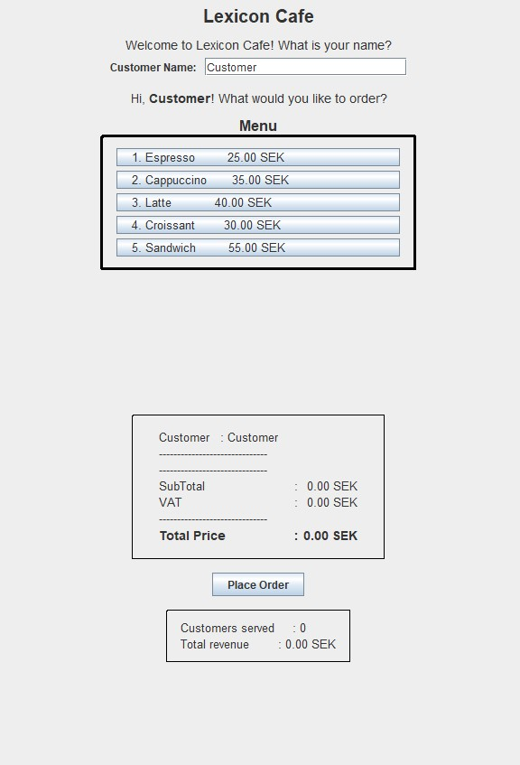
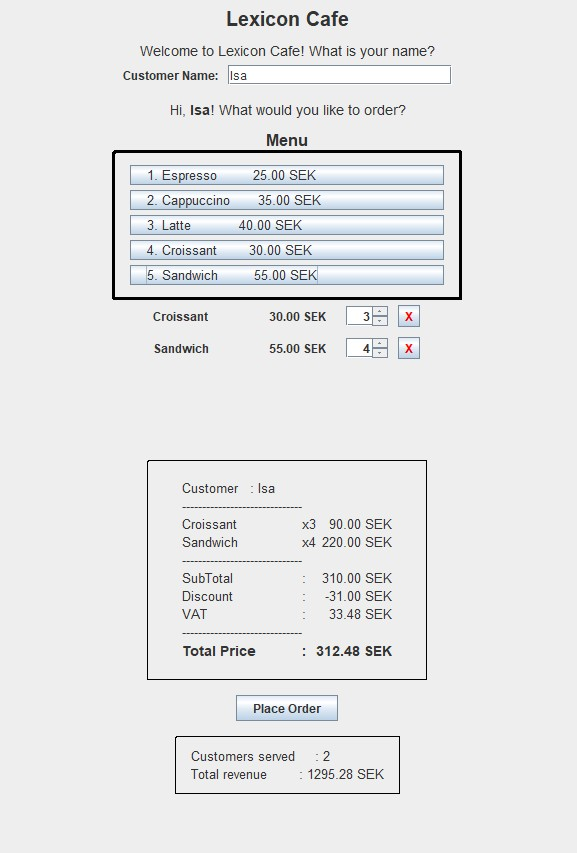

# Java Workshop Cafe

## Summary

### Task
The task was to build a simple console application for a cafe that lets customers order items from a menu, calculates the total cost including discounts and VAT, and prints a receipt.

Each challenge was developed in its own branch and merged into main afterwards.  
Challenge 2 doesn't have its own branch, since I ended up implementing its solution directly while working on the base task.

### GUI
I hadn't used the Java Swing library for UI panels like this before — I'd only touched it briefly for a Java game, in a different context — so this part was new territory for me, and the only section where I leaned on AI to help me move forward the way I wanted to.  

Even so, I worked through it step by step, learned the process along the way, and wrote as much of it by hand as I could.

### Screenshots

<table>
  <tr>
    <td></td>
    <td></td>
  </tr>
</table>
